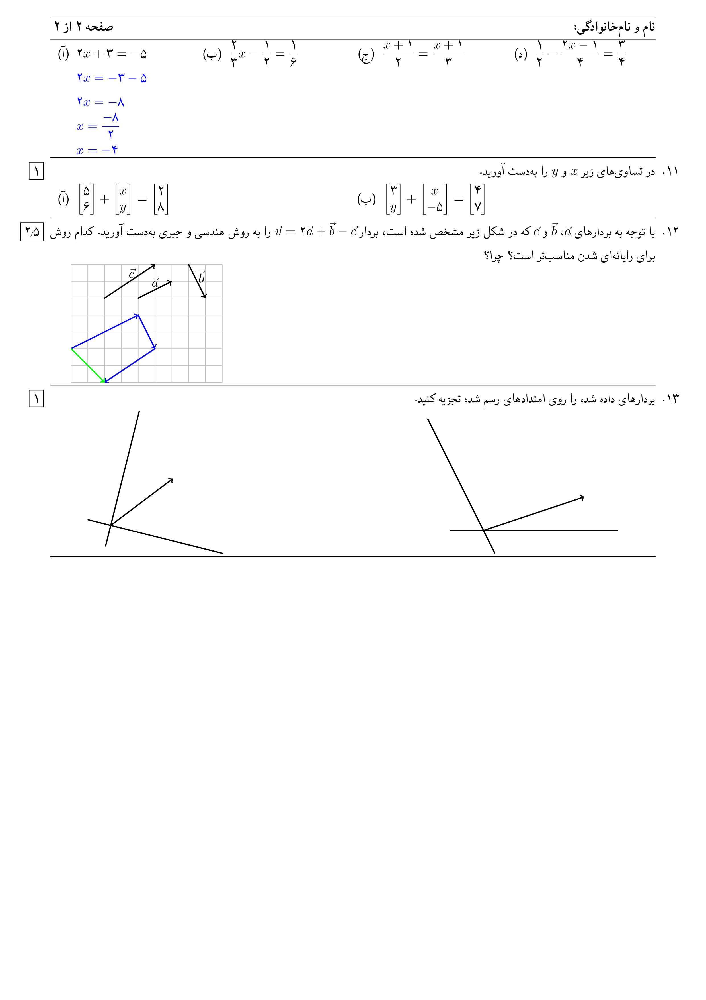

# آزمون

آزمون کلاسی برای ساخت برگه‌ امتحانی در لاتک با استفاده از بسته زی‌پرشین است.

## فهرست

- پیش‌نیاز
- نصب
   - ویندوز
   - لینوکس
- نمونه سند 

## پیش‌نیاز
- تک‌لایو

    برای استفاده از این کلاس نیاز به یکی از توزیع‌های تک مانند تک‌لایو دارید. البته فقط بر روی تک‌لایو امتحان شده است ولی توزیع‌های دیگر نیز باید به درستی کار کند.

- بسته‌های مورد نیاز:
   - bidi
   - biditools 
   - xepersian
   - fancyhdr
   - mathtools
   - cancel
   - tikzpicture
   - pgf
   - pgfopts
   - enumitem
   - totcount
   - marginnote
   - graphicx
   - geometty
   - qrcode
   - dashrule

## نصب
- ویندوز

  برای نصب در ویندوز دستورات زیر را به ترتیب در cmd وارد کنید.
```cmd
  git clone https://gitlab.com/mojtab8286/azmoon.git
  mkdir %HOMEPATH%\texmf\tex\xelatex\azmoon
  copy azmoon\source\azmoon %HOMEPATH%\texmf\tex\xelatex\azmoon\
```
- گنو/لینوکس

  برای نصب در یکی از توزیع‌های لینوکس دستورات زیر را به ترتیب در ترمینال وارد کنید.
```bash
  git clone https://gitlab.com/mojtaba8286/azmoon.git
  mkdir -p ~/texmf/tex/xelatex
  cp -r azmoon/source/azmoon ~/texmf/tex/xelatex
```
## نمونه سند
```tex
\documentclass[template=fantasy,11pt,headonall]{azmoon}
\usepackage{xepersian}
\settextfont{Yas}
\setdigitfont{Yas}

\printanswers

\teacher{آقای باغبان}
\teachertitle{دبیر}
\city{لارستان}
\schooltitle{دبیرستان}
\school{فارابی}
\grade{هشتم}
\branch{شهید جعفری‌نژادان}
\topic{ریاضی}
\examdate{96/12/23}
\answertime{60 دقیقه}
\begin{document}
	\begin{questions}
		\nointerlineskip%
		\vskip-\baselineskip
		\section{سوالات درست یا نادرست}
		\question[1]{
			عبارت‌ درست را با ‎\truesym و عبارت نادرست را با ‎\falsesym مشخص کنید.
			\begin{truefalse}[2]
				\itemt{جمله‌های $3x^2y$ و $-5yx^2$ متشابه هستند.}
				\itemf{حاصل‌ضرب عدد فرد در عدد زوج عددی فرد است.}
				\itemt{تفاضل هر عدد دورقمی از مقلوبش مضرب 9 است.}
				\itemt{حاصل‌جمع عدد فرد با عدد زوج عددی فرد است.}
			\end{truefalse}
		}
		\section{سوالات جاخالی}
		\question[2]{%
			جاهای خالی را با عبارت مناسب پر کنید.
			\begin{parts}[2]
				\part{حاصل‌جمع سی و هفت عدد فرد عددی \fillin[1.5cm]{فرد} است.}
				\part{عبارت $-(a-b+c)$ برابر \fillin[2.5cm]{$-a+b-c$} است.}
				\part{اگر برآیند دو بردار برابر بردار صفر شود، گوییم که دو بردار \fillin[1.5cm]{قرینه} یکدیگرند.}
				\part{ضریب عددی جمله $\dfrac{-7ax}{3}$ برابر \fillin[1cm]{$\dfrac{-7}{3}$} است.}
			\end{parts}
		}
		\section{سوالات چهارگزینه‌ای}
		\question[0.5]{%
			اگر 
			$\vec{a}=\pvector{-1}{3}$
			و 
			$\vec{b}=\pvector{2}{-6}$ 
			حاصل 
			$2‎\vec{a}+\vec{b}‎$ برابر با کدام گزینه است؟
			\begin{fourchoice}
				\choice{$\pvector{3\\1}$}
				\choiceok{$\pvector{0\\0}$}
				\choice{$\pvector{1\\1}$}
				\choice{$\pvector{-1\\-1}$}
			\end{fourchoice}
		}
		\question[0.5]{%
			جمله‌ی $5xy^2$
			با کدام گزینه متشابه است؟
			\begin{fourchoice}
				\choiceok{$-2y^2x$}
				\choice{$5xy$}
				\choice{$5yx^2$}
				\choice{$5x^2y^2$}
			\end{fourchoice}
		}
		\section{سوالات بلندپاسخ}
		\question[3]{%
			حاصل عبارت‌های زیر را به‌دست آورید.
			\begin{LTR}
				\begin{parts}[2]
					\part{$2xy-5x-7xy-7x=$ \answer{$-5xy-12x$}}
					\part{$(x-4)(x+7)=$ \answer{$x^2+7x-4x-28=x^2+3x-28$}}
					\numcols{1}
					\part{$(3x+2y)(3x-2y)=$ \answer{$9x^2-6xy+6xy-4y^2=9x^2-4y^2$}}
					\part{$(2x-3y)^2=$ \answer{$(2x-3y)(2x-3y)=4x^2-6xy-6xy+9y^2=4x^2-12xy+9y^2$}}
				\end{parts}
			\end{LTR}	
		}
		\question[1.5]{%
			با توجه به جدول زیر و رابطه $y=2x+3$ جاهای خالی را پر کنید.
			\begin{LTR}
				\begin{tabular}{c|cccc}
					$x$ & $-2$ & $-\dfrac{3}{2}$ & \fillin[0cm]{$\dfrac{-1}{2}$} & \fillin[0cm]{$-3$} \\ \hline
					$y$ & \fillin[0cm]{$-1$} & \fillin[0cm]{$0$} & $2$ & $-3$
				\end{tabular}
			\end{LTR}
		}
		%	\noprintlinesep
		\question[2]{%
			عبارات زیر را تجزیه کنید.
			\begin{LTR}
				\begin{parts}[2]
					\part{$4x^2y+6xy^2=$ \answer{$2xy(2x+3y)$}}
					\part{$8x^2y^3-4xy^2=$ \answer{$4xy^2(2xy-1)$}}
					\part{$42xy^3-35x^2y^2=$ \answer{$7xy^2(6y-5x)$}}
				\end{parts}
			\end{LTR}
		}
		%\printlinesep
		\question[1.5]{%
			با تجزیه صورت و مخرج، کسر زیر را ساده کنید.
			\begin{LTR}
				$\dfrac{a^2b-ab^2}{a^3b^2-a^2b^3}=$ \answer{$\dfrac{ab\cancel{(a-b)}}{a^2b^2\cancel{(a-b)}}=\dfrac{1}{ab}$}
			\end{LTR}
		}
		\question[1.5]{%
			معادله‌های زیر را حل کنید.
			\begin{LTR}
				\begin{parts}
					\part{$\pvector{2\\7}+\vec{x}=\pvector{5\\3}$}
					\vspace{.2cm}
					\part{$2\vec{x}+\pvector{3\\1}=9\vec{i}-5\vec{j}$}
				\end{parts}
			\end{LTR}
		}
		\question[2]{%
			معادله‌های زیر را حل کنید.
			\begin{LTR}
				\begin{parts}[4]
					\part{
						$2x+3=-5$
						\answer[2.5cm]{$\\2x=-3-5\\2x=-8\\x=\dfrac{-8}{2}\\x=-4$}
					}
					\part{$\dfrac{2}{3}x-\dfrac{1}{2}=\dfrac{1}{6}$}
					\part{$\dfrac{x+1}{2}=\dfrac{x+1}{3}$}
					\part{$\dfrac{1}{2}-\dfrac{2x-1}{4}=\dfrac{3}{4}$}
				\end{parts}
			\end{LTR}
		}
		\question[1]{%
			در تساوی‌های زیر $x$ و $y$ را به‌دست آورید.
			\begin{LTR}
				\begin{parts}[2]
					\part{$\pvector{5\\6}+\pvector{x\\y}=\pvector{2\\8}$}
					\part{$\pvector{3\\y}+\pvector{x\\-5}=\pvector{4\\7}$}
				\end{parts}
			\end{LTR}
		}
		\question[2.5]{%
			با توجه به بردارهای $‎\vec{a}‎$، $‎\vec{b}‎$ و $‎\vec{c}‎$ که در شکل زیر مشخص شده است، بردار $\vec{v}=2\vec{a}+\vec{b}-\vec{c}$ را به روش هندسی و جبری به‌دست آورید. کدام روش برای رایانه‌ای شدن مناسب‌تر است؟ چرا؟‎
			\definecolor{cqcqcq}{rgb}{0.7529411764705882,0.7529411764705882,0.7529411764705882}
			\begin{LTR}
				\hspace{.5cm}
				\begin{tikzpicture}[line cap=round,line join=round, x=.5cm,y=.5cm]
				\draw [color=cqcqcq,, xstep=.5cm,ystep=.5cm] (0,0) grid (9,7);
				\clip(0.,0.) rectangle (9.,7.);
				\draw [->,line width=1.pt] (4.,5.) -- (6.,6.);
				\draw [->,line width=1.pt] (7.,7.) -- (8.,5.);
				\draw [->,line width=1.pt] (2,5) -- (5,7);
				\answer{%
					\draw [->,line width=1.pt, color=blue] (0,2) -- (4,4);
					\draw [->,line width=1.pt, color=blue] (4,4) -- (5,2);
					\draw [->,line width=1.pt, color=blue] (5,2) -- (2,0);
					\draw [->,line width=1.pt, color=green] (0,2) -- (2,0);
				}
				%		\begin{scriptsize}
				\draw[color=black] (5,5.95) node {$\vec{a}$};
				\draw[color=black] (7.75,6.3) node {$\vec{b}$};
				\draw[color=black] (3.6,6.5) node {$\vec{c}$};
				%		\end{scriptsize}
				\end{tikzpicture}
			\end{LTR}
		}
		\question[1]{%
			بردارهای داده  شده را روی امتدادهای رسم شده تجزیه کنید.
			\begin{LTR}
				\hspace{1cm}
				\begin{tikzpicture}[line cap=round,line join=round,x=1.0cm,y=1.0cm]
				\draw [line width=1.pt] (1.,1.)-- (2.,5.);
				\draw [line width=1.pt] (0.48,1.78)-- (4.48,0.78);
				\draw [->,line width=1.pt] (1.1529411764705884,1.6117647058823532) -- (3.,3.);
				\end{tikzpicture}
				\hfill
				\begin{tikzpicture}
				\draw [line width=1.pt] (7.34,4.32)-- (9.34,0.32);
				\draw [line width=1.pt] (8.,1.)-- (13.,1.);
				\draw [->,line width=1.pt] (9.,1.) -- (12.,2.);
				\end{tikzpicture}
				\hspace{1cm}
			\end{LTR}
		}
	\end{questions}
\end{document}
```
در حال حاضر سه قالب tabling و classic و fantasy برای این کلاس طراحی شده است که برای تغییر قالب باید هنگام فراخوانی کلاس مقدار template را برابر قالب دلخواه خود قرار دهید.

### قالب فانتزی:


### قالب جدولی


### قالب کلاسیک

